# Software Quality and Developer Intelligence System (SQDIS)

SQDIS is an enterprise-grade developer analytics, code quality intelligence, and automated deployment safety platform. It connects static compiler analysis, statistical machine learning models, and real-time production telemetry to create a completely closed-loop engineering feedback lifecycle—from pull request creation to production canary deployment and automated rollback.

---

## Architecture Overview

SQDIS uses a high-performance, polyglot microservice architecture designed for high-throughput Git ingestion, compiler-grade AST parsing, statistical risk scoring, and real-time WebSocket broadcasting.

```mermaid
flowchart TB
    subgraph ClientLayer ["Client & Ingress Layer"]
        UI["React 18 + Vite SPA (:5173)<br/>(Dashboard, Studio, Treemap, Radar)"]
        WS_Client["Socket.IO Realtime Client"]
        GitHubWebhook["GitHub Commit & PR Webhooks"]
    end

    subgraph CoreBackend ["NestJS Enterprise Core Gateway (:3000)"]
        AuthMod["Auth & RBAC Guards<br/>(JWT Rotation, Bcrypt)"]
        OrgMod["Organizations & Tenancy<br/>(Context-Aware Guard)"]
        GitMod["GitHub Integration & PR Bot<br/>(HMAC-SHA256, Check Runs)"]
        CommitMod["Commits & Ingestion Pipeline<br/>(Batch Upsert, Churn Tracking)"]
        DebtMod["Technical Debt Scanner<br/>(TODO / FIXME / HACK)"]
        QGMod["Quality Gate & Policy Engine<br/>(Configurable Thresholds)"]
        RemediationMod["Code Remediation Advisor<br/>(Smell Detection & Recipes)"]
        TreemapMod["Repository Treemap Engine<br/>(POSIX Tree & Quadrants)"]
        ReleaseMod["Releases & Rollback Dispatcher<br/>(Idempotent CI/CD Webhooks)"]
        DashMod["Dashboard & Aggregations<br/>(Raw SQL, Leaderboards)"]
        SocketMod["WebSocket Gateway<br/>(Redis-Backed Rooms)"]
    end

    subgraph StorageCache ["Data & Event Bus Layer"]
        Postgres[("PostgreSQL 16<br/>(Multi-Tenant Relational Schema)")]
        Redis[("Redis 7<br/>(Cluster Pub/Sub & Caching)")]
    end

    subgraph MLCompilerTier ["FastAPI ML & Compiler Engine (:8000)"]
        subgraph StaticCompilers ["Compiler AST Analysis"]
            TreeSitterTS["Tree-sitter TS/JS/Python AST Engine"]
            MinHashEngine["MinHash & LSH Clone Detector (O(N))"]
            TIADag["Test Impact Analysis Graph (G^T BFS)"]
            SmellEngine["AST Anti-Pattern Smell Detector"]
        end

        subgraph StatisticalML ["Machine Learning Models"]
            DQS_XGB["Developer Quality Score (XGBoost Regressor)"]
            SHAP_Exp["Transparent Feature Attribution"]
            SQS_RF["Software Quality Score (Random Forest)"]
            JIT_Defect["Commit Defect Risk Classifier"]
            NASA_Module["Static Module Bug Predictor"]
            BusFactorEngine["Knowledge Silo & Bus Factor (Gini Frontier)"]
            CanaryDetector["Canary Telemetry Evaluator"]
        end
    end

    subgraph ObservabilityMesh ["Observability Stack"]
        Prometheus["Prometheus TSDB (:9090)<br/>(Container & Host Metrics)"]
        Grafana["Grafana Dashboards (:3001)"]
        Loki["Grafana Loki Log Aggregator (:3100)"]
    end

    subgraph ExternalDelivery ["External CI/CD & Production"]
        ExtCI["CI/CD Orchestrator<br/>(GitHub Actions / ArgoCD / Kubernetes)"]
        ProdContainers["Production Canary Containers"]
    end

    %% Client Interactions
    UI --> AuthMod
    WS_Client <--> SocketMod
    GitHubWebhook --> GitMod

    %% Backend Data Flow
    GitMod --> CommitMod
    CommitMod --> Postgres
    DebtMod --> Postgres
    QGMod --> Postgres
    ReleaseMod --> Postgres

    %% Backend to ML / Compiler Bridge
    CommitMod -->|"POST /api/ml/defects/predict"| JIT_Defect
    GitMod -->|"POST /api/ml/test-impact"| TIADag
    RemediationMod -->|"POST /api/ml/code-quality/analyze"| SmellEngine
    TreemapMod -->|"AST Churn & Complexity"| StaticCompilers
    ReleaseMod -->|"POST /api/ml/telemetry/canary-analysis"| CanaryDetector

    %% Telemetry & Observability
    ProdContainers --> Prometheus
    CanaryDetector -->|"PromQL Queries"| Prometheus
    Prometheus --> Grafana

    %% Closed-Loop Rollback
    ReleaseMod -->|"HMAC Rollback Webhook"| ExtCI
    ExtCI -->|"Rollout Undo"| ProdContainers

    %% Realtime Streaming
    QGMod -->|Publish Event| Redis
    ReleaseMod -->|Publish Incident| Redis
    Redis -->|Broadcast| SocketMod
    SocketMod -->|Live Updates| WS_Client
```



---

## Core Platform Capabilities

### 1. Automated Pull Request Quality Gate & Bot
- **Automated Webhook Inspection**: Evaluates pull requests on open, synchronize, and reopen events.
- **Branch Protection Check Runs**: Automatically blocks or approves merges based on repository quality standards.
- **Idempotent Bot Comments**: Posts concise, markdown-formatted quality summaries and updates previous comments without spamming PR review threads.
- **Configurable Thresholds**: Define repository-level maximum defect risk tolerance, cyclomatic complexity limits, and minimum test coverage targets.
- **Real-Time Event Streaming**: Broadcasts quality gate evaluations across Redis Pub/Sub, updating open dashboard drawers instantly via WebSockets.

### 2. Code Intelligence & Architecture Hotspots
- **Multi-Language AST Parsing**: Native Tree-sitter integration for TypeScript, JavaScript, and Python, computing exact Cyclomatic Complexity and Cognitive Complexity without regex false positives.
- **Sub-Linear Code Clone Detection**: MinHash 4-gram token shingling and Locality-Sensitive Hashing ($O(N)$) identifying Type-1, Type-2, and Type-3 semantic duplicates.
- **Repository Hotspot Treemap**: Hierarchical, squarified space-partitioning treemap with directory drill-down and a 4-quadrant Churn vs. Complexity matrix highlighting high-risk **Danger Zone** files.
- **Automated Code Remediation Advisor**: AST smell detector identifying anti-patterns (deep nesting, complex conditionals, runaway complexity) and generating step-by-step refactoring blueprints with before-and-after diffs.
- **Dual-Mode Studio**: Unified command center toggling between live repository architecture hotspots and an interactive pre-commit developer sandbox.

### 3. Test Impact Analysis (TIA via Dependency Graphs)
- **Graph-Theoretic Test Pruning**: Constructs in-memory repository dependency graphs, transposes edges ($G^T$), and uses Breadth-First Search (BFS) to identify affected modules on pull requests.
- **80–95% CI/CD Suite Pruning**: Safely runs only the unit and integration tests impacted by modified files, accelerating CI pipeline feedback.

### 4. Operational Telemetry & Automated Rollback
- **Canary Telemetry Radar**: Correlates release versions with live Prometheus container telemetry (P95 latency deltas, 5xx HTTP error rates, and RSS memory growth).
- **5-Factor Release Readiness Scoring**: Evaluates bug resolution scores, test coverage, code quality metrics, test pass rates, and container stability index.
- **Automated Deployment Rollback**: Idempotent rollback execution dispatching HMAC-signed webhooks to external deployment orchestrators (GitHub Actions, ArgoCD, Kubernetes) to revert traffic safely during critical regressions.
- **In-App Incident Alerting**: Dispatches urgent notifications to engineering teams with direct links to the affected release audit trail.

### 5. Developer & Team Performance Analytics
- **Software Quality Score (SQS)**: 0–100 composite index measuring test density, documentation coverage, code churn balance, and defect history.
- **Developer Quality Score (DQS)**: Transparent, explainable contributor scoring powered by XGBoost regression and SHAP attribution values.
- **Knowledge Silos & Bus Factor Engine**: Quantifies key-person project dependencies using Gini ownership concentration and the 80% ownership frontier.
- **Agile & DORA Delivery Tracking**: Sprint planning velocity, burn-down calculations, deployment frequency, lead time for changes, and change failure rates.

---

## Live UI Navigation & Route Map

| Section | Route | Capabilities |
| :--- | :--- | :--- |
| **Executive Overview** | `/dashboard` | High-level engineering KPIs, SQS trendlines, active developer counts, and quality leaderboards. |
| **Code Intelligence** | `/code-intelligence` | Dual-mode studio, live repository explorer, AST analysis, TIA test pruner, and Bus Factor radar. |
| **Architecture Treemap** | `/code-intelligence` *(Live Explorer)* | Squarified hierarchical treemap, 4-quadrant Danger Zone matrix, and remediation advice drawer. |
| **Releases & Telemetry** | `/releases` & `/releases/:id` | Deployment tracking, 5-factor release readiness, live canary telemetry radar, and emergency rollback. |
| **Code Reviews & PRs** | `/reviews` | PR review turnaround times, SLA tracking, and Pull Request Quality Gate Inspector drawer. |
| **Quality Gate Policies** | `/settings/quality-gate` | Repository-level rule management, threshold sliders (defect risk, complexity, coverage), and compliance history. |
| **Projects & Debt** | `/projects` & `/projects/:id` | Multi-repository rollups, technical debt lifecycle tracking (`TODO`/`FIXME`), and health breakdown. |
| **Teams & Silos** | `/teams` & `/teams/:id` | Team lead assignments, developer rosters, project allocation, and knowledge silo radar. |
| **Developers Roster** | `/developers` & `/developers/:id` | Contributor profiles, 30-day velocity, DQS score trendlines, and commit statistics. |
| **Agile Sprints** | `/sprints` & `/sprints/:id` | Sprint planning, committed vs. completed points, burn-down charts, and sprint velocity reports. |

---

## Technology Stack

### Frontend Client
- **React 18 & Vite**: Component-based user interface with rapid hot module replacement and optimized production bundle chunking.
- **TypeScript**: Full end-to-end type safety across data transfer objects, UI state, and API contracts.
- **Tailwind CSS**: Responsive, dark-mode-ready styling with custom semantic color tokens.
- **TanStack Query (React Query)**: Reactive server state management, automated query invalidation, and optimistic caching.
- **Socket.IO Client**: Real-time bidirectional event streaming for live PR evaluations and rollback notifications.
- **Recharts**: Modular data visualization for burndown charts, latency trends, and radar diagrams.
- **Lucide Icons**: Consistent, clean iconography across all interface panels.

### Enterprise Backend Core
- **NestJS**: Modular enterprise framework providing dependency injection, interceptors, and controller decorators.
- **Prisma ORM & PostgreSQL 16**: Type-safe relational schema with strict foreign key constraints, indexes, and migrations.
- **Redis 7 & BullMQ**: In-memory caching, cluster-wide Pub/Sub event broadcasting, and background worker queues.
- **Passport.js & JWT**: Dual-token rotation (15m access / 7d refresh), bcrypt hashing, and context-aware tenant guards.
- **Cryptographic Security**: AES-256-GCM encryption for stored GitHub tokens and HMAC-SHA256 signature verification for inbound and outbound webhooks.

### Machine Learning & Compiler Mesh
- **FastAPI (Python 3.11)**: High-performance asynchronous API for ML inference and compiler operations.
- **Tree-sitter**: C-bindings for multi-language AST parsing (TypeScript, JavaScript, Python) with sub-millisecond complexity extraction.
- **XGBoost & scikit-learn**: Machine learning regressors and classifiers trained on empirical benchmarks.
- **SHAP (SHapley Additive exPlanations)**: Transparent feature attribution demystifying scoring calculations.
- **NetworkX**: In-memory directed acyclic graph (DAG) construction and traversal for Test Impact Analysis.

### Observability & Infrastructure
- **Docker Compose**: Containerized multi-service mesh with health check dependencies.
- **Prometheus TSDB**: Scrapes container metrics, request latencies, and API performance for canary regression analysis.
- **Grafana, Loki & Tempo**: Centralized dashboards, distributed log aggregation, and trace visualization.

---

## How to Run Locally

You can run SQDIS either using Docker Compose (recommended for full functionality) or by starting each service manually.

### Prerequisites
- Docker and Docker Compose (v2.20+)
- Node.js (v20 or higher)
- npm (v10 or higher)
- Python (v3.11 or higher, if running services outside Docker)

---

### Option 1: Running with Docker Compose (Recommended)

1. **Clone the repository and enter the directory**:
   ```bash
   git clone https://github.com/mahin273/SQDIS.git
   cd SQDIS
   ```

2. **Configure environment variables**:
   ```bash
   cp .env.example .env
   ```

3. **Build and launch all 12 container services**:
   ```bash
   docker compose up -d --build
   ```

4. **Seed the database with presentation demo data**:
   ```bash
   docker compose exec backend npm run db:seed
   ```

5. **Access the platform**:
   - **Web Application**: [http://localhost:5173](http://localhost:5173)
   - **Backend API**: [http://localhost:3000](http://localhost:3000)
   - **Swagger API Documentation**: [http://localhost:3000/api/docs](http://localhost:3000/api/docs)
   - **ML & Compiler Service**: [http://localhost:8000](http://localhost:8000)
   - **Grafana Observability**: [http://localhost:3001](http://localhost:3001)
   - **Prometheus Metrics**: [http://localhost:9090](http://localhost:9090)

---

## Demo & Presentation Credentials

The database can be seeded with realistic data for live demonstrations and testing:

```bash
docker compose exec backend npm run db:seed
```

| Role | Name | Email | Password | Organization | Permissions |
| :--- | :--- | :--- | :--- | :--- | :--- |
| 👑 **Owner / Admin** | Admin User | `admin@sqdis.local` | `Admin123!` | Acme Software Corporation (`acme-corp`) | Full access, settings, unmapped emails, policies, and rollbacks |
| 👩‍💼 **Team Lead** | Sarah Teamlead | `lead@sqdis.local` | `Password123!` | Acme Software Corporation (`acme-corp`) | Sprints, goals, teams, and project management |
| 👨‍💻 **Developer 1** | Alex Developer | `dev1@sqdis.local` | `Password123!` | Acme Software Corporation (`acme-corp`) | Commits, reviews, DQS metrics, and studio sandbox |
| 👨‍💻 **Developer 2** | Jordan Smith | `dev2@sqdis.local` | `Password123!` | Acme Software Corporation (`acme-corp`) | Commits, reviews, DQS metrics, and studio sandbox |

---

### Option 2: Running Services Manually

#### 1. Start Database & Infrastructure
```bash
docker compose up -d db redis prometheus grafana
```

#### 2. Start Backend Core
```bash
cd backend
npm install
npx prisma generate
npx prisma db push
npm run start:dev
```

#### 3. Start ML & Compiler Service
```bash
cd ml-service
python3 -m venv venv
source venv/bin/activate
pip install -r requirements.txt
python3 -m app.main
```

#### 4. Start Frontend Client
```bash
cd frontend
npm install
npm run dev
```

---

## Testing & Verification

Each tier includes dedicated automated test suites:

- **Backend Spec Tests**:
  ```bash
  cd backend
  npm run test
  ```
- **Frontend Component & Service Tests**:
  ```bash
  cd frontend
  npm run test -- --run
  ```
- **Frontend Production Compilation**:
  ```bash
  cd frontend
  npm run build
  ```

---

## Architectural Lessons & Best Practices

Throughout development, several key enterprise patterns were reinforced:
1. **Context-Aware Guard Routing**: Tenant isolation guards inspect the request path to avoid confusing nested resource IDs (`/api/projects/:id`) with organization IDs.
2. **Defensive API Contract Normalization**: Frontend services defensively unwrap both paginated envelopes (`{ items, total }`) and flat arrays to prevent client runtime exceptions.
3. **Idempotent Incident Dispatching**: Release rollback mutations verify the current state in PostgreSQL before dispatching outbound CI/CD webhooks, preventing duplicate execution during concurrent calls.
4. **TypeScript Reflection Safety**: Decorator-bearing controllers use `import type` for pure interfaces to prevent runtime metadata emission errors under strict compilation.

---

*SQDIS — Software Quality and Developer Intelligence System.*
