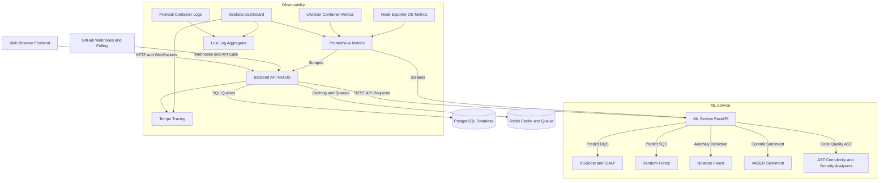

# Software Quality and Developer Intelligence System (SQDIS)

The Software Quality and Developer Intelligence System is a multi-tenant platform that monitors software development quality by analyzing GitHub repositories and calculating scores for code repositories and individual developer contributions.

## Architecture

SQDIS is built using a service-oriented architecture with a web frontend, an API backend, a dedicated machine learning service, and an observability stack.



### System Components

1. Frontend Client: A single-page application built with React, TypeScript, and Vite. It consumes the API backend to visualize metrics, dashboards, sprint reports, and developer profiles.
2. Backend API: A NestJS application that acts as the orchestration layer. It manages database persistence, schedules cron syncs, processes GitHub webhooks via queues, handles WebSocket updates, and coordinates calls to the ML service.
3. ML Service: A FastAPI application written in Python. It loads pre-trained machine learning models to calculate Developer Quality Scores, Software Quality Scores, commit classification, anomaly detection, sentiment analysis, and code quality metrics.
4. Database and Cache: PostgreSQL serves as the relational store for users, organizations, teams, and commit history. Redis acts as the caching layer and job queue database (via BullMQ).
5. Observability Stack: A Prometheus, Loki, Tempo, and Grafana pipeline that tracks container metrics, logs, and distributed traces across the entire application runtime.

## Tech Stack

### Frontend
- React: Chosen for building reusable component-based user interfaces with a declarative programming model.
- TypeScript: Selected to ensure static type safety, reduce runtime bugs, and provide autocomplete support during development.
- Vite: Replaces Webpack to provide fast hot module replacement and build speeds during local development.
- Tailwind CSS: Chosen for layout design without writing complex external stylesheets.
- Zustand: A lightweight state management library used for application UI states.
- TanStack Query: Used for fetching, caching, and synchronizing backend server state in React.
- Recharts: Chosen to create modular charts and graphs for sprint reports and profiles.

### Backend
- NestJS: A structural framework that helps partition backend services into clean modules, controllers, and providers.
- Prisma ORM: Next-generation Node.js and TypeScript ORM, selected for type-safe query generation and migration tracking.
- Passport.js: Used to implement local username-password authentication, JSON Web Tokens, and GitHub/Google OAuth integrations.
- BullMQ: Redis-backed queue system for NestJS to process background tasks (like GitHub webhook processing and commit ingestion).
- Socket.io: Selected to establish WebSocket connections for push updates (e.g., live commit analysis results).
- PDFKit and csv-stringify: Selected to generate PDF reports and CSV datasets for offline team reviews.

### ML Service
- FastAPI: A modern, high-performance web framework for Python APIs, chosen for its speed and native validation support.
- scikit-learn: Provides baseline regression, classification, and clustering utilities.
- XGBoost: Used to train the Developer Quality Score regression models due to its execution speed and accuracy.
- SHAP: Integrated to explain predictions from the XGBoost models, ensuring developer scoring criteria remains transparent.
- VADER Sentiment: A lexical rule-based model chosen for calculating developer sentiment from commit messages and code review comments.

### Infrastructure and Observability
- PostgreSQL: Relational database chosen for schema validation, table constraints, and transactional consistency.
- Redis: Used as an in-memory key-value store, caching engine, and message queue database.
- Prometheus: Scrapes application metrics to monitor resource utilization and API performance.
- Grafana: Used to construct dashboards that visualize metrics, logs, and distributed traces in a single interface.
- Loki, Promtail, and Tempo: Used to collect container logs and traces, enabling developers to debug slow requests across microservices.

## How to Run Locally

You can run SQDIS either using Docker Compose (recommended) or by starting each service manually.

### Prerequisites
Ensure you have the following installed on your machine:
- Docker and Docker Compose
- Node.js (v20 or higher)
- npm (v10 or higher)
- Python (v3.11 or higher, if running manually)

### Option 1: Running with Docker Compose (Recommended)

1. Clone the repository and navigate to the project root:
   ```bash
   cd SQDIS
   ```

2. Copy the environment variables template:
   ```bash
   cp .env.example .env
   ```

3. Open the newly created `.env` file and configure credentials as needed.

4. Build and start all services:
   ```bash
   docker compose up --build
   ```

5. Seed the database with demo/viva presentation data:
   ```bash
   docker compose exec backend npm run db:seed
   ```

6. The services will be accessible at the following URLs:
   - **Frontend Client**: http://localhost:5173
   - **Backend API**: http://localhost:3000
   - **API Docs (Swagger)**: http://localhost:3000/api/docs
   - **ML Service**: http://localhost:8000
   - **Grafana Dashboards**: http://localhost:3001
   - **Prometheus**: http://localhost:9090

---

## Demo & Presentation Credentials

The database can be seeded with realistic data for presentations and viva testing:

```bash
# From backend directory
npm run db:seed
```

| Role | Name | Email | Password | Organization | Permissions |
| :--- | :--- | :--- | :--- | :--- | :--- |
| 👑 **Owner / Admin** | Admin User | `admin@sqdis.local` | `Admin123!` | Acme Software Corporation (`acme-corp`) | Full access, settings, unmapped emails, org deletion |
| 👩‍💼 **Team Lead** | Sarah Teamlead | `lead@sqdis.local` | `Password123!` | Acme Software Corporation (`acme-corp`) | Manage sprints, goals, teams, project assignments |
| 👨‍💻 **Developer 1** | Alex Developer | `dev1@sqdis.local` | `Password123!` | Acme Software Corporation (`acme-corp`) | View sprints, commits, DQS metrics, profile settings |
| 👨‍💻 **Developer 2** | Jordan Smith | `dev2@sqdis.local` | `Password123!` | Acme Software Corporation (`acme-corp`) | View sprints, commits, DQS metrics, profile settings |

### Option 2: Running Services Manually

If you prefer to run services manually for debugging purposes, follow these steps:

#### 1. Start Database and Cache Services
Use Docker to launch PostgreSQL and Redis containers:
```bash
docker compose up -d db redis
```

#### 2. Run Database Migrations and Start the Backend
Navigate to the backend directory, install dependencies, generate the Prisma client, and start the development server:
```bash
cd backend
npm install
npx prisma generate
npx prisma db push
npm run start:dev
```

#### 3. Start the ML Service
Navigate to the ml-service directory, set up a Python virtual environment, install requirements, and start the FastAPI server:
```bash
cd ml-service
python3 -m venv venv
source venv/bin/activate
pip install -r requirements.txt
python3 -m app.main
```

#### 4. Start the Frontend
Navigate to the frontend directory, install dependencies, and start the Vite dev server:
```bash
cd frontend
npm install
npm run dev
```
Open http://localhost:5173 in your web browser.

## Known Limitations

- GitHub API Rate Limiting: Ingesting repository history relies on the GitHub API, which limits requests to 5000 per hour. Initial synchronization for large repositories with thousands of commits can hit this rate limit, delaying scoring analytics.
- Offline and Firewalled Deployments: Inbound webhooks from GitHub require the SQDIS instance to be publicly accessible. Local testing behind a firewall requires setting up a reverse proxy or tunnel tool like ngrok.
- Static Model Weights: Machine learning models run calculations using pre-trained serialized files. Predictions do not dynamically adjust to daily feedback overrides; retraining models requires running an offline workflow to generate new model artifacts.
- Sentiment Jargon Misinterpretation: VADER sentiment analysis uses general English rules. Standard software engineering phrases such as killing a process or debugging bad code can sometimes be falsely classified as negative sentiment.
- Single-Node Queue Architecture: The Redis task queue is designed for single-node installations. For large-scale multi-tenant enterprise deployments, a dedicated distributed queue system would be required to handle webhook spikes.

## What We Would Do Differently

- Transition to an Event-Driven Architecture: Using Redis and BullMQ as both a cache and a task queue couples the backend components. Migrating to an event broker like RabbitMQ or Apache Kafka would decouple webhook ingestion and allow the ML service to consume commit events directly.
- Stream Processing for ML Inference: Instead of REST API requests from the backend to the ML service, we would implement stream processing using a framework like Apache Flink. This would calculate quality scores continuously as commits are pushed.
- Automated Model Retraining Pipeline: We would construct a closed-loop retraining pipeline. Score overrides logged via the telemetry feedback system would auto-trigger MLflow retraining runs, automatically updating the model endpoints.
- Semantic Embeddings for Code Analysis: VADER sentiment analysis and scikit-learn classifiers could be replaced with specialized developer-focused transformer models. This would capture semantic intent from commit messages and code reviews more accurately.
- Unified Monorepo Tooling: We would implement a monorepo manager such as NX or Turborepo to unify the frontend, backend, and ML workspaces. This would share TypeScript interfaces, optimize dependency matching, and speed up testing pipelines.

---

*SQDIS — Software Quality and Developer Intelligence System.*
